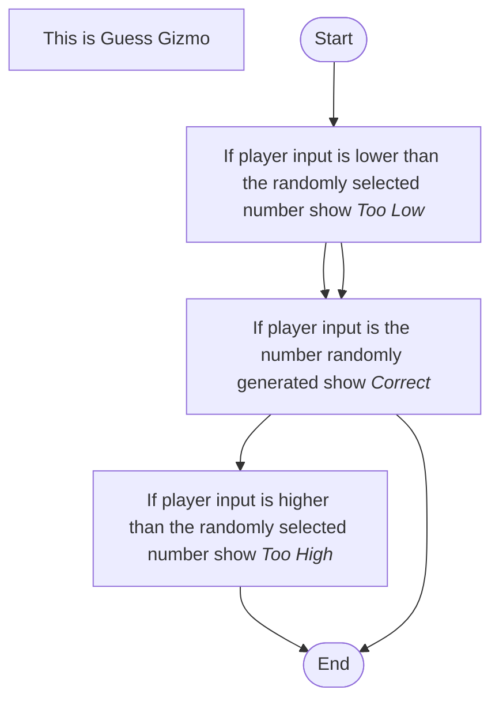

Step 1: It generates a random number from 1 to 100.
Step 2: Waits for player input.
Step 3: It tells the player if they are "Too High", "Too Low", or "Correct" depending on their input.
Step 4: The game ends.
