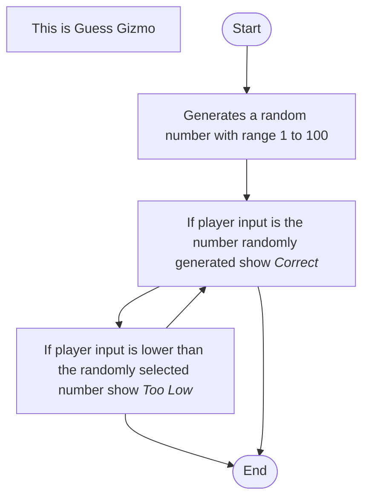

```mermaid
flowchart TD
id[This is Guess Gizmo]
Start([Start]) --> newLines["`Generates a random number with range 1 to 100`"] -->
NODE_STRING["`If player is incorrect shows _Incorrect_`"] --> 
COMMA["`If player input is higher than the randomly selected number show _Too High_`"] --> End([End])
COMMA["`If player input is lower than the randomly selected number show _Too Low_`"] -->
NODE_STRING["`If player input is the number randomly generated show _Correct_`"] -->
End([End])
```
